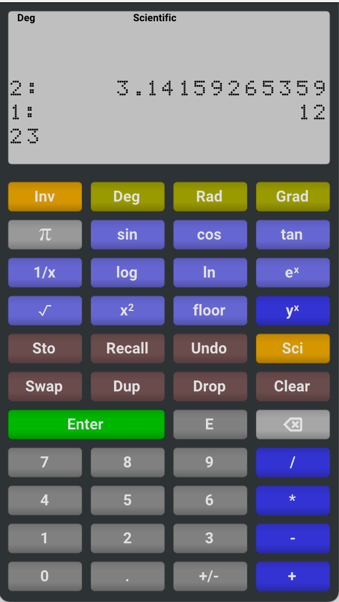

# RPN Calculator

A simple RPN Calculator, demonstrating how easy it can be to create a  truly multi-platform application with 
[Dear ImGui](https://github.com/ocornut/imgui), and [Hello ImGui](https://github.com/pthom/hello_imgui).

Works under Windows, Linux, macOS, emscripten, iOS (as a native app, or as a Web Clip)

[Online calculator](https://traineq.org/HelloImGui/rpn/rpn_calculator.html)

[Video explanation](https://www.youtube.com/watch?v=dArP4lBnOr8)

