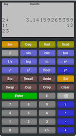

# RPN Calculator

A simple RPN Calculator, demonstrating how easy it can be to create a  truly multi-platform application with 
[Dear ImGui](https://github.com/ocornut/imgui), and [Hello ImGui](https://github.com/pthom/hello_imgui).

Works under Windows, Linux, macOS, emscripten, iOS (as a native app, or as a Web Clip)

[Online calculator](https://traineq.org/HelloImGui/rpn/rpn_calculator.html)

[Video explanation](https://www.youtube.com/watch?v=dArP4lBnOr8)




### Build for Linux and macOS

#### 1. Optional: clone hello_imgui

_Note: This step is optional, since the CMakeLists.txt file will be default download and build hello_imgui at configure time._

In this example, we clone hello_imgui inside `external/hello_imgui`.

Note: `external/` is mentioned in `.gitignore`

```bash
mkdir -p external && cd external
git clone https://github.com/pthom/hello_imgui.git
cd ..
```

Add this line at the top of your CMakeLists.txt

```cmake
add_subdirectory(external/hello_imgui)
```

#### 2. Create the build directory, run cmake and make

```bash
mkdir build && cd build
cmake ..
make -j 4
```

### Build for Windows

#### 1. Optional: clone hello_imgui
Follow step 1 from the Linux/macOS section above.

#### 2. Create the build directory, run cmake

```bash
mkdir build && cd build
cmake ..
```

#### 3. Open the Visual Studio solution
It should be located in build/rpn_calculator.sln


### Build for Android

#### 1. Clone hello_imgui:
You will need to clone hello_imgui. In this example, we clone hello_imgui inside hello_imgui_template/external/hello_imgui 

Note: external/ is mentioned in .gitignore

```bash
mkdir -p external && cd external
git clone https://github.com/pthom/hello_imgui.git
cd ..
```

Add this line at the top of your CMakeLists.txt

```cmake
add_subdirectory(external/hello_imgui)
```

#### 2. Download SDL
Run the following command to download SDL2:

```bash
./external/hello_imgui/tools/sdl_download.sh
```

#### 3. Create the Android Studio project
```bash
mkdir build_android && cd build_android
../external/hello_imgui/tools/android/cmake_arm-android.sh ../
```

#### 4. Open the project in Android Studio
It should be located in build_android/rpn_calculator_AndroidStudio.


### Build for iOS

#### 1. Clone hello_imgui and download SDL: follow steps 1 and 2 from the Android section above.

#### 2. Create the Xcode project
```bash
mkdir build_ios && cd build_ios
```

Run CMake with the following command, where you replace XXXXXXXXX with your Apple Developer Team ID,
and com.your_website with your website (e.g. com.mycompany).

```bash
cmake .. \
-GXcode \
-DCMAKE_TOOLCHAIN_FILE=../external/hello_imgui/hello_imgui_cmake/ios-cmake/ios.toolchain.cmake \
-DPLATFORM=OS64COMBINED \
-DCMAKE_XCODE_ATTRIBUTE_DEVELOPMENT_TEAM=XXXXXXXXX \
-DHELLO_IMGUI_BUNDLE_IDENTIFIER_URL_PART=com.your_website \
-DHELLOIMGUI_USE_SDL_OPENGL3=ON
```

Then, open the XCode project in build_ios/rpn_calculator.xcodeproj
